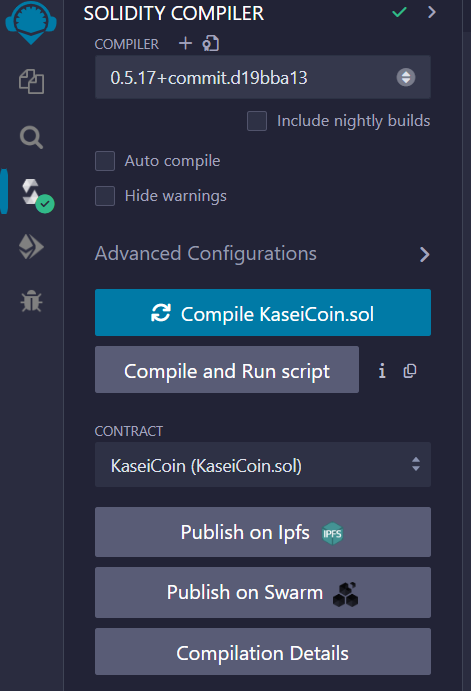
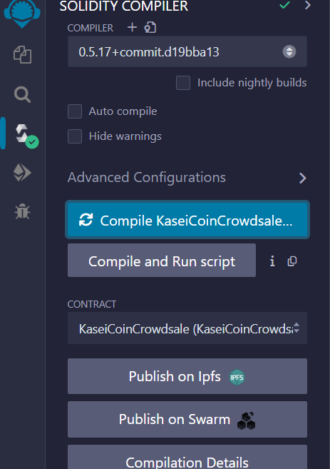
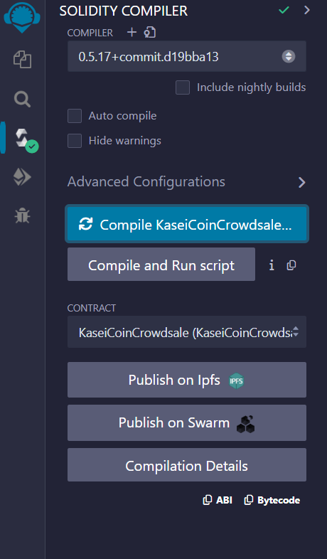
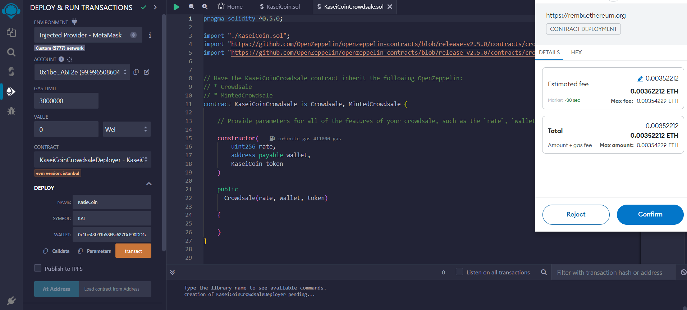
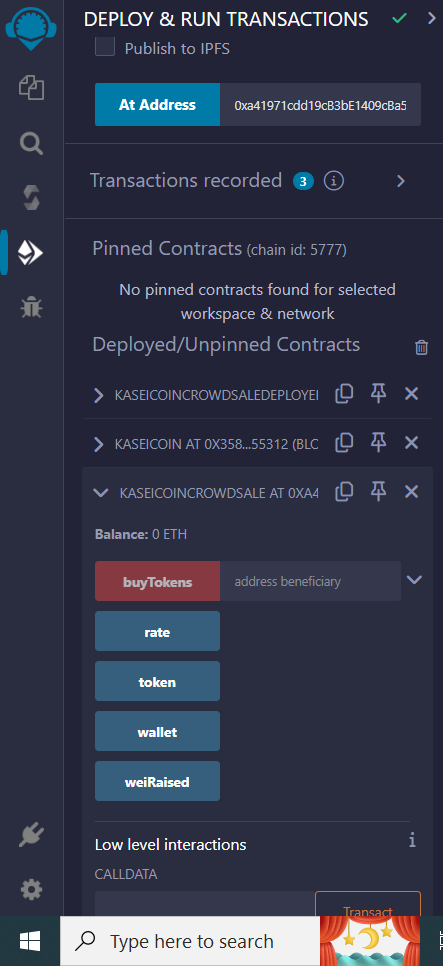
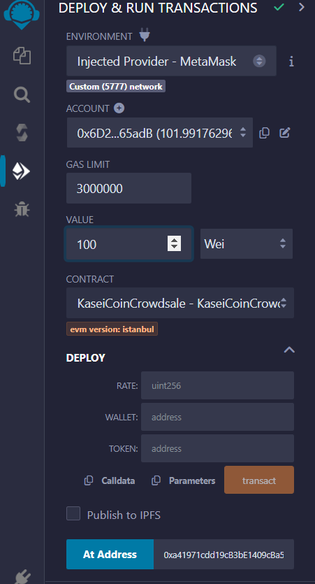
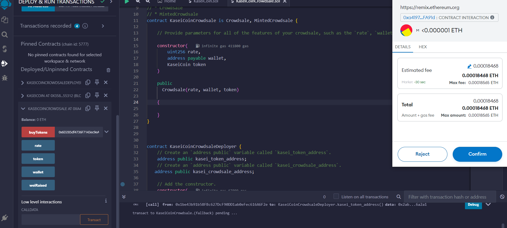
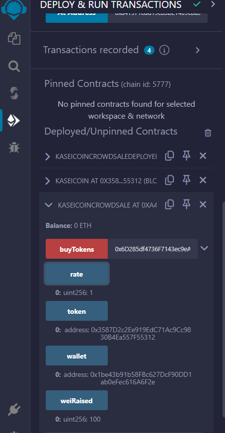
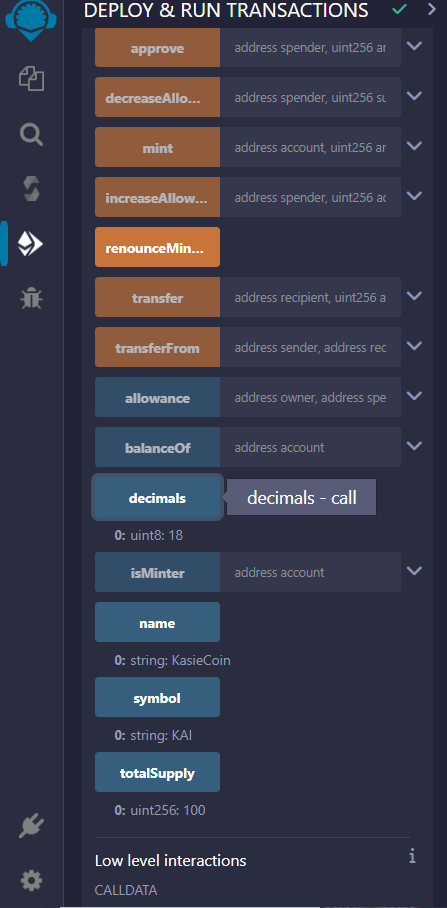
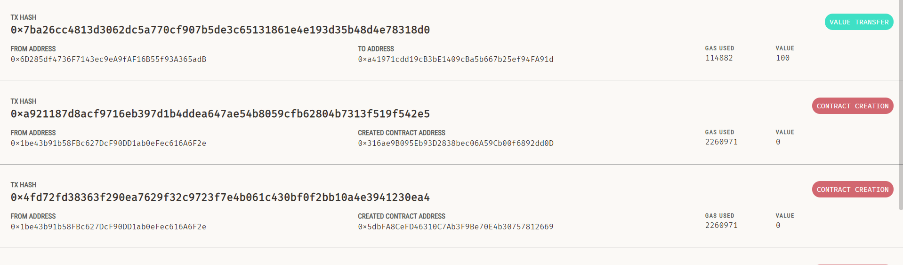

This coding file is a solidity smart contract that implemented new cryptocurrency, named KaseiCoin to develop a monetary system for the fictitious colony on Mars. KaseiCoin will be a fungible token that’s ERC-20 compliant. For that we'll launch a crowdsale that will allow people who are moving to Mars to convert their earthling money to KaseiCoin.

Notable features of project include creation of,

* A fungible token that’s ERC-20 compliant and that will get minted via a crowdsale contract that we create based on the Crowdsale contract from the Solidity library.

* A crowdsale contract which manages the entire crowdsale process. Specifically, it will allow users to send ether to the contract and receive KAI, or KaseiCoin tokens, in return. The contract will automatically mint the tokens and distribute them to buyers in one transaction.

* Deploy the Crowdsale to a Local Blockchain

# Evaluation Evidence

## KasieCoin Token Contract Compiler

| KasieCoin                                                    | KasieCoin Crowdsale                                           | KasieCoin CrowdsaleDeployer   

| |  | 

## Deploying Crowdsale to a Blockchain using MetaMask

    | 
 

## Buying Coins

## Ganache Validation

